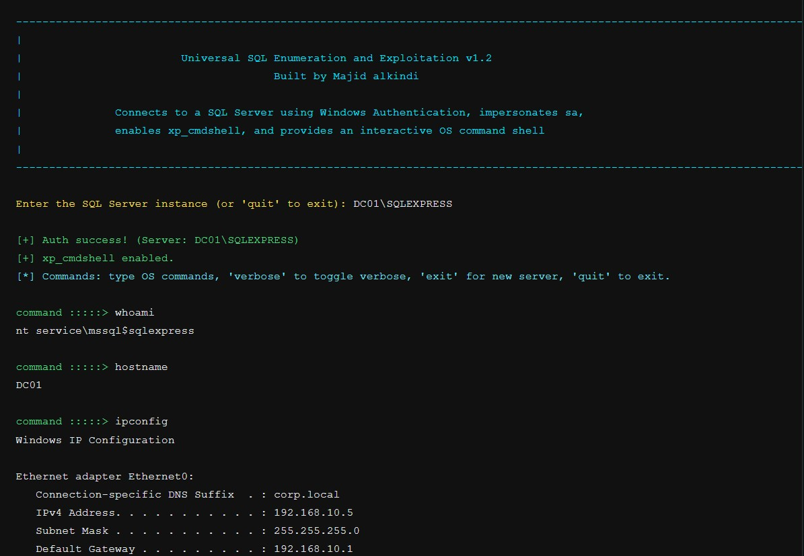

# Microsoft SQL Server Remote Code Execution

Interactive SQL Server command execution utility for authorized security testing.

## Disclaimer

**For educational and authorized security testing only.**

This tool is designed for ethical hacking labs, penetration testing demos, and controlled research environments where you have explicit permission. Do not use it against systems you do not own or operate without written authorization.

## Overview

Microsoft SQL Server Remote Code Execution is a C# console application that:

- Connects to a Microsoft SQL Server instance using Windows Integrated Authentication.
- Attempts to impersonate `sa`.
- Enables `xp_cmdshell` through `sp_configure`.
- Provides an interactive command loop that runs OS commands through SQL Server.
- Supports reconnecting to multiple servers in a single session.

## Current Capabilities

- Interactive shell prompt for command execution.
- Toggleable verbose mode (`-v`, `--verbose`, or `verbose` during runtime).
- Connection progress spinner in verbose mode.
- Colored console output for prompts, status, warnings, and errors.
- Built-in loop control commands:
	- `exit`: disconnect and return to server selection.
	- `quit`: terminate the program.

## Requirements

- Windows host with .NET Framework runtime compatible with the project.
- Network connectivity to target SQL Server instance.
- Valid Windows-authenticated access to SQL Server.
- SQL Server permissions sufficient to run:
	- `EXECUTE AS LOGIN = 'sa'`
	- `sp_configure`
	- `xp_cmdshell`

## Build

From the project directory:

```powershell
msbuild SQL_RCE.csproj /p:Configuration=Debug /v:minimal
```

Output binary:

- `bin/Debug/SQL_RCE.exe`

## Run

Standard mode:

```powershell
.\bin\Debug\SQL_RCE.exe
```

Verbose mode:

```powershell
.\bin\Debug\SQL_RCE.exe -v
```

or:

```powershell
.\bin\Debug\SQL_RCE.exe --verbose
```

## Runtime Commands

At the `command :::::>` prompt:

- Enter any OS command to execute via `xp_cmdshell`.
- `verbose`: toggle verbose mode on or off.
- `exit`: disconnect current target and go back to server prompt.
- `quit`: exit the tool.

## Demonstration

The screenshot below shows the tool in action:


